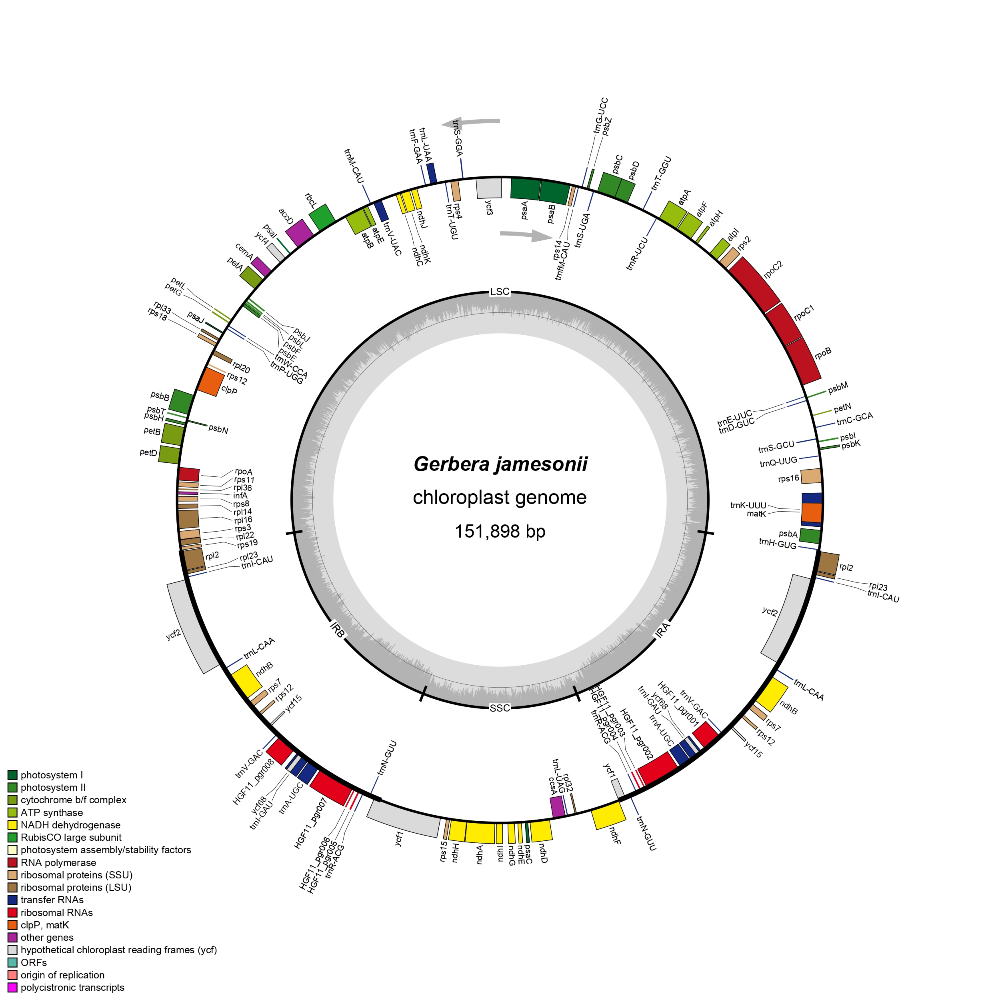

# Plastid Genome Visualization

## Lab Title
**Visualize Plastid Genome Structure**

## Student Information
**Name:** Klea Mae G. Estrellanes  
**Course:** BS Biology  
**Section:** Section B

## Selected Plastid Genome
**Scientific name:** *Gerbera jamesonii*  
**Organelle:** Chloroplast  
**NCBI Accession:** NC_046760.1  
**Genome length:** 151,898 bp  

## Source Genome File
The annotated GenBank file used for this activity was downloaded from the NCBI record for *Gerbera jamesonii* chloroplast, complete genome.

**File:** `data/Gerbera_jamesonii_NC_046760.1.gb`

The original annotated GenBank file was retained unchanged and used as the input for genome visualization.

## Genome Visualization Software
**Software:** OrganellarGenomeDRAW (OGDRAW)

OGDRAW was used to generate a circular plastid genome map from the annotated GenBank file.

### OGDRAW Settings
- Map mode: Standard
- Genome type: Plastid
- Map shape: Circular
- Automatic IR detection: Enabled
- GC content graph: Enabled
- Direction of transcription: Enabled
- Full legend: Enabled
- Intron-containing gene labels: Enabled
- Output format: PNG
- Resolution: Fine

## Plastid Genome Map


## Structural Features

The chloroplast genome of *Gerbera jamesonii* is 151,898 bp long and has the typical quadripartite plastid genome organization consisting of a large single-copy (LSC) region, a small single-copy (SSC) region, and two inverted repeat regions (IRa and IRb). The LSC region extends from 1–83,518 bp, IRb from 83,519–108,586 bp, the SSC from 108,587–126,830 bp, and IRa from 126,831–151,898 bp. The genome map displays protein-coding genes, tRNA genes, rRNA genes, gene orientation, inverted-repeat regions, and the GC-content graph.

## Answers

The answers to the ten questions for this activity are provided in:

[Lab Plastid Genome Visualization Answers](answers/Lab_plastid_genome_answers.md)

## Repository Organization

```text
Lab_Plastid_Genome_Visualization/
├── README.md
├── data/
│   └── Gerbera_jamesonii_NC_046760.1.gb
├── figures/
│   └── Gerbera_jamesonii_plastid_map.png
└── answers/
    └── Lab_plastid_genome_answers.md
