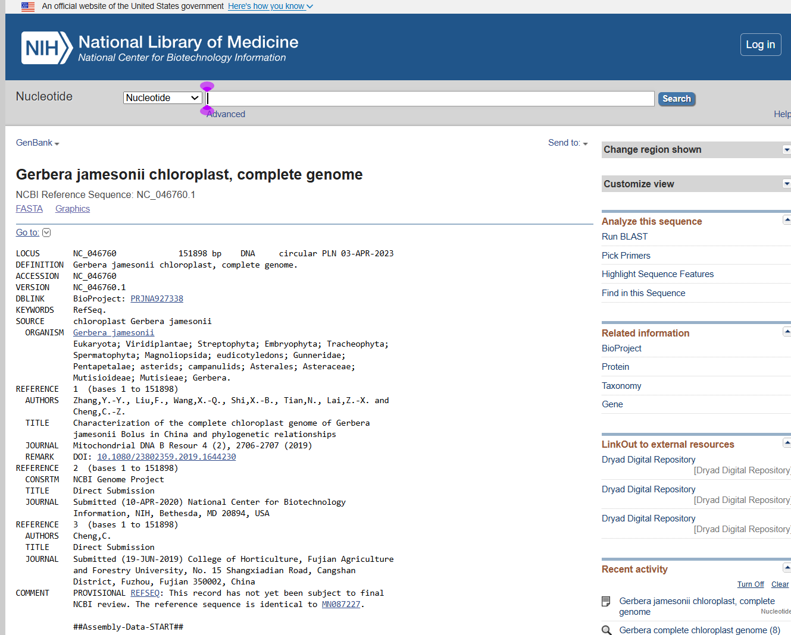

# Characterization of the Complete Plastid Genome of *Gerbera jamesonii*

## 1. Student Information

- **Student:** Klea Mae G. Estrellanes
- **Course:** Cell & Molecular Biology
- **Section:** B
- **Activity:** Characterization of a Plastid Genome
- **Selected Genus:** *Gerbera*
- **Selected Species:** *Gerbera jamesonii*
- **NCBI Accession/Version:** NC_046760.1
- **Date Genome Retrieved:** September 30, 2026
- **Galaxy History:** `Plastid_Gerbera_Estrellanes`

---

## 2. Purpose

This activity characterized a complete plastid/chloroplast genome of *Gerbera jamesonii* using an annotated NCBI RefSeq record and Galaxy sequence statistics. The activity focused on verifying genome completeness, describing plastome organization, summarizing annotated genes and RNA features, identifying introns and pseudogenes, examining inverted repeats, comparing plastid and mitochondrial genomes, and documenting the analysis in GitHub.

The activity followed the requirements of the Cell & Molecular Biology laboratory exercise, which requires retrieval and verification of a complete plastid genome, Galaxy analysis, plastid-genome characterization, plastid-versus-mitochondrial comparison, and documentation in GitHub.

---

## 3. Genome Selection and Data Source

The selected organism was *Gerbera jamesonii*. The genome was obtained from **NCBI Nucleotide/RefSeq**.

### NCBI Record

| Feature | Information |
|---|---|
| Record title | *Gerbera jamesonii* chloroplast, complete genome |
| Accession | NC_046760.1 |
| Organism | *Gerbera jamesonii* |
| Family | Asteraceae |
| Organelle | Plastid:chloroplast |
| Genome length | 151,898 bp |
| Topology | Circular |
| Completeness | Full length |
| Cultivar | Linglong |
| Database | NCBI Nucleotide/RefSeq |

**NCBI Record:**  
https://www.ncbi.nlm.nih.gov/nuccore/NC_046760.1

The NCBI record identifies the sequence as a complete chloroplast genome, identifies the source organelle as plastid:chloroplast, reports a length of 151,898 bp, and states that the sequence is full length.

### Associated Publication

Zhang, Y.-Y., Liu, F., Wang, X.-Q., Shi, X.-B., Tian, N., Lai, Z.-X., & Cheng, C.-Z. (2019). Characterization of the complete chloroplast genome of *Gerbera jamesonii* Bolus in China and phylogenetic relationships. *Mitochondrial DNA Part B: Resources, 4*(2), 2706–2707.

**DOI:** https://doi.org/10.1080/23802359.2019.1644230

---

## 4. Files Obtained

Two types of sequence information were retained for the analysis:

1. **FASTA sequence** — used for upload to Galaxy and calculation of basic sequence statistics.
2. **Annotated GenBank/RefSeq record** — used to examine genes, coordinates, introns, pseudogenes, inverted repeats, and other annotated features.

---

# 5. Galaxy Analysis

## Galaxy History

The Galaxy history was named:

`Plastid_Gerbera_Estrellanes`

## Uploaded Dataset

The FASTA dataset was named:

`Gerbera_jamesonii_NC_046760.1`

## Tool Used

**Fasta Statistics — Galaxy Version 2.0**

## Galaxy Results

| Statistic | Result |
|---|---:|
| Genome length | 151,898 bp |
| Number of sequence records | 1 |
| GC content | 37.74% |
| Number of gaps | 0 |

The Galaxy result confirms that the uploaded FASTA contains one sequence record representing the 151,898-bp plastid genome and that no gaps were detected in the uploaded sequence.

A Galaxy screenshot showing the history, uploaded dataset, and statistics output is included in the `figures/` folder.

---

# 6. Plastid Genome Characterization

## Summary Table

| Feature | Result |
|---|---|
| Genus | *Gerbera* |
| Species | *Gerbera jamesonii* |
| Family | Asteraceae |
| Accession/version | NC_046760.1 |
| Genome type | Chloroplast/plastid genome |
| Genome size | 151,898 bp |
| Topology | Circular |
| GC content | 37.74% |
| LSC | 83,518 bp |
| SSC | 18,244 bp |
| IR | 25,068 bp each |
| Genome organization | LSC–IR–SSC–IR |
| NCBI gene features | 133 |
| CDS features | 88 |
| tRNA features | 35 |
| rRNA features | 8 |
| Repeat regions | 2 inverted-repeat annotations |
| Pseudogene-marked gene features | 3 |
| Unique `/gene=` names | 109 |
| Sequence records in Galaxy | 1 |
| Gaps in Galaxy FASTA | 0 |

### Annotation Note

The current NC_046760.1 NCBI annotation and the original 2019 publication do not report exactly the same annotation counts. The values in the table above are based on the **current NCBI NC_046760.1 record** used for this activity.

The 2019 publication reported **113 unique genes**, including **80 protein-coding genes, 29 tRNAs, and 4 rRNAs**.

These historical publication values are kept separate from the current NCBI feature counts to avoid mixing annotation versions.

---

# 7. Questions for the Student Report

## Question 1. Give the full scientific name, family, NCBI accession/version, database source, and complete plastid-genome size of your selected organism.

The selected organism is *Gerbera jamesonii*, which belongs to the family **Asteraceae**. Its complete chloroplast genome is available in the NCBI RefSeq database under accession **NC_046760.1**. The genome is **151,898 bp** long and is reported as a circular, complete chloroplast genome.

- **Scientific name:** *Gerbera jamesonii*
- **Family:** Asteraceae
- **Database:** NCBI Nucleotide/RefSeq
- **Accession:** NC_046760.1
- **Genome size:** 151,898 bp

---

## Question 2. What evidence shows that the sequence is a complete plastid/chloroplast genome rather than a barcode marker, genome fragment, or nuclear sequence?

Several pieces of evidence support that the sequence is a complete chloroplast genome. First, the NCBI record is explicitly titled **“Gerbera jamesonii chloroplast, complete genome.”** Second, the source annotation identifies the organelle as **plastid:chloroplast**. Third, the record reports a length of **151,898 bp** and states that the sequence is **full length**.

The sequence also contains many characteristic chloroplast genes, including photosystem genes, ATP synthase genes, ribosomal protein genes, tRNA genes, rRNA genes, and other conserved plastid genes.

The Galaxy analysis also produced one sequence record with a length of 151,898 bp, consistent with the complete plastome used in this activity.

---

## Question 3. Describe the overall organization of the plastid genome. Does it contain the common LSC-IR-SSC-IR arrangement? Give the sizes of these regions when available.

Yes. The *Gerbera jamesonii* plastid genome has the common:

**LSC–IR–SSC–IR**

organization.

The two inverted-repeat regions are approximately:

- **IR1:** 83,519–108,586 bp
- **IR2:** 126,831–151,898 bp

Each IR is **25,068 bp** long.

Therefore:

- **LSC:** 83,518 bp
- **IR:** 25,068 bp each
- **SSC:** 18,244 bp
- **Genome organization:** LSC–IR–SSC–IR

The two IR regions contribute to the duplicated portion of the plastome and explain why some genes occur in two copies.

---

## Question 4. Summarize the annotated gene content: total genes, protein-coding genes, tRNA genes, rRNA genes, and pseudogenes. Explain why genes located in the inverted-repeat regions may appear in two copies.

The current NC_046760.1 NCBI annotation contains:

- **133 gene features**
- **88 CDS features**
- **35 tRNA features**
- **8 rRNA features**
- **109 unique `/gene=` names**

Three gene features are marked as pseudogenes:

- two *ycf68* features
- one *ycf1* feature

The genome also contains two inverted-repeat regions. Genes located within an IR can occur in two physical copies because the IR itself is duplicated. Therefore, genes located within these duplicated regions can appear twice in the annotated genome.

The original 2019 publication reported **113 unique genes**, consisting of **80 protein-coding genes, 29 tRNAs, and 4 rRNAs**. The difference between the publication and current NCBI counts reflects differences in annotation versions.

---

# 8. Question 5 — Protein-Coding Genes

Choose at least eight protein-coding plastid genes from different functional groups.

| Gene | Functional Group | Biological Function |
|---|---|---|
| **psaA** | Photosystem I | Encodes a major core protein of Photosystem I involved in light-driven electron transfer. |
| **psbA** | Photosystem II | Encodes the D1 reaction-center protein of Photosystem II and participates in photosynthetic electron transport. |
| **atpA** | ATP synthase | Encodes the CF1 alpha subunit of ATP synthase and participates in ATP production during photophosphorylation. |
| **petA** | Cytochrome b6f | Encodes cytochrome f, a component of the cytochrome b6f complex involved in electron transport. |
| **rbcL** | Carbon fixation | Encodes the large subunit of Rubisco, an enzyme involved in carbon fixation. |
| **rpoB** | RNA polymerase | Encodes the beta subunit of plastid-encoded RNA polymerase and participates in transcription. |
| **rps16** | Ribosomal protein | Encodes ribosomal protein S16, a component of the plastid ribosome. |
| **matK** | RNA processing | Encodes maturase K, which is associated with intron processing in chloroplast transcripts. |
| **accD** | Fatty-acid metabolism | Encodes the beta subunit of acetyl-CoA carboxylase carboxyltransferase and contributes to fatty-acid biosynthesis. |
| **cemA** | Chloroplast envelope | Encodes a chloroplast envelope membrane protein associated with plastid envelope functions. |

These genes demonstrate that the plastid genome contains genes involved in photosynthesis, ATP production, electron transport, transcription, translation, RNA processing, metabolism, and chloroplast structure.

---

# 9. Question 6 — RNA and RNA-Processing Features

The current NCBI annotation contains **8 rRNA features** and **35 tRNA features**.

### Examples of tRNA genes

- *trnH-GUG*
- *trnK-UUU*
- *trnN-GUU*
- *trnR-ACG*
- *trnL-CAA*
- *trnI-GAU*
- *trnI-CAU*
- *trnA-UGC*

### Examples of intron-containing genes

- **rps16**
- **rpoC1**
- **atpF**
- **ycf3**

For example, the *rps16* CDS is represented by joined coordinates, showing that its coding sequence is interrupted by an intron. The *rpoC1* and *atpF* CDS features are also represented using joined exon coordinates.

The annotation also contains a trans-spliced **rps12** feature, which is an important RNA-processing characteristic of plastid genomes.

---

# 10. Question 7 — Pseudogenes, Duplications, and Other Features

The current NCBI annotation marks **three gene features as pseudogenes**:

- two *ycf68* features
- one *ycf1* feature

The genome also contains **two inverted-repeat regions**, which produce duplication of genes located within those regions.

The original publication reported **18 duplicated genes** in the IR regions, including:

- 7 protein-coding genes
- 7 tRNA genes
- 4 rRNA genes

The selected NCBI record does not explicitly report a major large-scale plastome rearrangement. Therefore, no additional rearrangement or gene loss is claimed without specific evidence from the record.

---

# 11. Question 8 — GC Content and Other Observations

The Galaxy Fasta Statistics result gives a **GC content of 37.74%**.

### Observation 1 — One Sequence Record

Galaxy reports **one sequence record** with a length of **151,898 bp**. This represents the complete plastid sequence uploaded for the analysis.

### Observation 2 — Large Inverted Repeats

The annotated genome contains two inverted-repeat regions of **25,068 bp each**. These repeats divide the genome into the characteristic LSC, IR, SSC, and IR regions.

### Additional Observation — No Gaps

The Galaxy result reports **0 gaps**, meaning that no gap characters were detected in the uploaded FASTA sequence.

---

# 12. Question 9 — Plastid vs. Mitochondrial Genome Comparison

| Feature | Plastid Genome | Mitochondrial Genome |
|---|---|---|
| **Cellular location** | Chloroplast/plastid | Mitochondrion |
| **Main biological functions** | Photosynthesis, carbon fixation, plastid gene expression, and other plastid functions | Cellular respiration, oxidative phosphorylation, and mitochondrial gene expression |
| **Typical genome organization** | Often compact and circular, commonly with LSC, SSC, and two IRs | Plant mitochondrial genomes can have complex structures, repeated sequences, and multiple physical molecules |
| **Relative genome size** | Usually relatively compact; *G. jamesonii* plastome = 151,898 bp | Highly variable among plants and often larger than plastomes |
| **Gene content** | Photosynthesis-related genes, ribosomal proteins, tRNAs, rRNAs, and other plastid genes | Mainly genes associated with respiration and mitochondrial gene expression |
| **Copy number** | Multiple plastid genome copies may occur within a cell/chloroplast | Multiple mitochondrial genome copies may occur within a cell/mitochondrion |
| **Inheritance** | Often uniparental, commonly maternal in many angiosperms, but varies among lineages | Commonly maternal in flowering plants, but inheritance can vary |
| **Recombination / structural change** | Generally more compact and structurally conserved, although variation occurs | Plant mitochondrial genomes can undergo substantial recombination and structural rearrangement |
| **Mutation / substitution pattern** | Generally useful for conserved phylogenetic comparisons | Different substitution and structural patterns from plastid genomes |
| **Common research applications** | Plant phylogeny, species identification, barcoding, population studies, comparative genomics | Mitochondrial evolution, cytoplasmic inheritance, respiration-related studies, and organelle evolution |

### Similarities

1. Both are organellar genomes.
2. Both are located outside the nucleus.
3. Both occur in multiple copies in cells.
4. Both contain genes that are expressed within their respective organelles.
5. Both can be used in evolutionary and phylogenetic studies.
6. Both can show characteristic cytoplasmic inheritance patterns.
7. Both contain their own genome organization and gene content.

### Differences

1. Plastids are primarily associated with photosynthesis and related metabolism, while mitochondria are primarily associated with cellular respiration and oxidative phosphorylation.
2. Plastid genomes are commonly compact and often have an LSC–IR–SSC–IR structure.
3. Plant mitochondrial genomes are generally much more structurally variable.
4. Plastid genomes contain photosynthesis-related genes such as *psa*, *psb*, *pet*, and *rbcL*.
5. Mitochondrial genomes contain genes associated mainly with mitochondrial respiratory functions.
6. Plant mitochondrial genomes can contain extensive repeats and undergo substantial recombination.
7. Plastid and mitochondrial genomes can differ in their evolutionary rates and patterns of structural change.

---

# 13. Question 10 — Practical Value of Plastid Genomes

Plastid genomes are useful in many areas of biological research because they provide a relatively compact source of genetic information.

## Advantages

1. **Phylogenetic analysis** — plastid sequences can be used to investigate evolutionary relationships among plants.
2. **Species identification** — plastid sequences can help distinguish closely related species.
3. **Plant systematics** — complete plastomes provide many genetic characters for classification.
4. **Comparative genomics** — plastid genomes can be compared across species to identify conserved and variable regions.
5. **Population studies** — plastid variation can help investigate genetic variation and geographic patterns.
6. **Maternal-lineage studies** — plastid inheritance can provide lineage information when inheritance is uniparental.
7. **Genome evolution** — plastomes can be used to study gene duplication, gene loss, introns, and structural changes.
8. **Photosynthesis research** — plastid genomes contain many genes directly involved in photosynthesis.
9. **Crop and ornamental-plant research** — plastid markers can support plant identification and evolutionary studies.
10. **Phylogenomics** — complete plastid genomes provide much more sequence information than a single barcode gene.
11. **Relatively compact analysis** — plastid genomes are generally much smaller than complete nuclear genomes.
12. **Conserved gene content** — many plastid genes can be compared among plant lineages.

## Limitations

Plastid genomes represent only one organelle and therefore do not contain the complete genetic information of the organism. Their inheritance is often uniparental, so they may not represent the complete history of parental contributions. Plastid genomes can also have limited variation among closely related organisms.

In addition, organelle evolutionary history does not necessarily represent the evolutionary history of the nuclear genome. Database annotation differences can also affect the reported number of genes and other features.

## Research Question Where Plastid Data Would Be Useful

**How are different *Gerbera* species and related Asteraceae species evolutionarily related based on their complete chloroplast genomes?**

## Research Question Where Nuclear Genomic Data Would Be More Appropriate

**Which nuclear genes or genome-wide variants are associated with a specific flower-color trait in *Gerbera*?**

A nuclear-genome dataset would be more appropriate for this question because complex traits can involve many nuclear genes and regulatory regions.

---

# 14. Analysis Workflow

The analysis followed these steps:

1. Selected the genus *Gerbera* after confirming that a complete plastid genome was available.
2. Selected *Gerbera jamesonii* and accession **NC_046760.1**.
3. Retrieved the complete FASTA sequence from NCBI.
4. Retrieved the annotated NCBI/RefSeq record.
5. Created the Galaxy history `Plastid_Gerbera_Estrellanes`.
6. Uploaded the FASTA file to Galaxy.
7. Renamed the dataset `Gerbera_jamesonii_NC_046760.1`.
8. Ran **Fasta Statistics — Galaxy Version 2.0**.
9. Recorded genome length, sequence-record count, GC content, and gap count.
10. Examined the annotated NCBI record for genes, CDS, tRNAs, rRNAs, introns, pseudogenes, and inverted repeats.
11. Determined the LSC, SSC, and IR sizes from the annotated genome coordinates.
12. Compared plastid and mitochondrial genomes.
13. Documented the results and interpretation in GitHub.

---

# 15. Evidence and Figures

The following screenshots document the genome retrieval and Galaxy analysis.

### NCBI Complete Genome Record

### Galaxy History and Uploaded Genome

### Galaxy Fasta Statistics Result

- Genome length: 151,898 bp
- Sequence records: 1
- GC content: 37.74%
- Number of gaps: 0

### Suggested filename

# 16. Repository Organization

The GitHub repository contains the README, source genome sequence, screenshots used as analysis evidence, and the final report.

    cmb-plastid-genome-gerbera-Estrellanes/
    ├── README.md
    ├── Gerbera_jamesonii_NC_046760.1.fasta
    ├── ncbi_complete_genome.png
    ├── Galaxy History.png
    └── Fasta Stats Result.jpg

# 17. Reproducibility

Another student can repeat this analysis by:

1. Opening NCBI Nucleotide.
2. Searching for accession **NC_046760.1**.
3. Downloading the FASTA sequence and annotated GenBank/RefSeq record.
4. Creating a Galaxy history named according to the instructor's required format.
5. Uploading the FASTA sequence.
6. Running a FASTA/sequence statistics tool.
7. Recording the sequence length, number of records, GC content, and gap count.
8. Examining the annotated GenBank record for gene features, RNA genes, introns, pseudogenes, and repeat regions.
9. Comparing the resulting observations with the values documented in this README.

# 18. Conclusion

The complete chloroplast genome of *Gerbera jamesonii* accession NC_046760.1 was characterized using NCBI annotation and Galaxy sequence statistics. The genome is a circular, full-length plastid sequence of **151,898 bp** with a **37.74% GC content** in the Galaxy analysis and one sequence record without gaps.

The plastome has the typical **LSC–IR–SSC–IR** organization, with an LSC of **83,518 bp**, an SSC of **18,244 bp**, and two IRs of **25,068 bp each**. The current NCBI annotation contains numerous protein-coding, tRNA, and rRNA features, as well as intron-containing genes, trans-spliced *rps12*, pseudogene-marked features, and duplicated genes associated with the inverted repeats.

Overall, the analysis demonstrates how a complete plastid genome can be retrieved from a public database, characterized computationally using Galaxy, and interpreted using genome annotation. Plastid genomes provide valuable information for plant systematics, phylogenetics, species identification, comparative genomics, and studies of plastid evolution, while nuclear genomes remain necessary for questions involving the broader genetic basis of complex traits and genome-wide variation.

# 19. References and Links

1. **NCBI Nucleotide/RefSeq.** *Gerbera jamesonii* chloroplast, complete genome. Accession NC_046760.1.  
   https://www.ncbi.nlm.nih.gov/nuccore/NC_046760.1

2. **Zhang, Y.-Y., Liu, F., Wang, X.-Q., Shi, X.-B., Tian, N., Lai, Z.-X., & Cheng, C.-Z. (2019).** Characterization of the complete chloroplast genome of *Gerbera jamesonii* Bolus in China and phylogenetic relationships. *Mitochondrial DNA Part B: Resources, 4*(2), 2706–2707.  
   https://doi.org/10.1080/23802359.2019.1644230

3. **Galaxy Project.** Galaxy platform used for sequence analysis.  
   https://usegalaxy.org/

4. **NCBI GenBank.** Sequence and annotation database.  
   https://www.ncbi.nlm.nih.gov/genbank/

5. **NCBI Nucleotide.** Public nucleotide sequence database.  
   https://www.ncbi.nlm.nih.gov/nuccore/

6. **Aoyagi, Y. B., et al. (2026).** Chromosome-level genome assembly of the Gerbera (*Gerbera hybrida*) using HiFi long-read and Hi-C technologies. *DNA Research*, 33(1). This reference provides a recent example of organellar-genome comparison in *Gerbera*.

# 20. Repository Information

**GitHub repository:** `cmb-plastid-genome-gerbera-Estrellanes`

**GitHub username:** `kleamae08`

**Selected organism:** *Gerbera jamesonii*

**NCBI accession:** NC_046760.1

**Galaxy history:** `Plastid_Gerbera_Estrellanes`

**Date retrieved:** September 30, 2026
